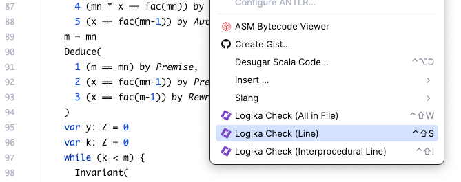

# logika-proof-language-case-studies

This repository holds examples that support the work in the paper:

> "Proof Engineering in Logika: Synergistically Integrating
  Automated and Semi-Automated Program Verification" 
  by Stefan Hallerstede, Robby, John Hatcliff, Jason Belt and David Hardin

- **Factorial (SMT)** [Factorial-SMT.sc](src/Factorial-SMT.sc)
  - used to illustrate Logika's SMT-based automated verification
    (to provide a contrast to the developer-directed version below
    that uses the Logika proof language.
   
- **Factorial (proof language)**  [Factorial.sc](src/Factorial.sc)
  - used to illustrate basic concepts of the Logika proof language, 
    including simplication (`Simpl`) and rewriting (`Rewrite`), 
    as well direct invocation of the SMT-based deduction 
    via the `Algebra` and `Auto` proof justifications. 
  
- **Doubly-Linked (DLL) List (with refinement from Cons list)** [DLLRefineList.sc](src/DLLRefineList.sc)
  - the primary case study in the paper.  The concrete implementation of the 
    DLL was originally written by author David Hardin (Collins Aerospace).
    Work reported on in this paper added the abstract Cons list 
    (which provides a basis for high-level specification of the concrete 
    implementation, via refinement),  as well as all specifications and 
    proofs.

- **Abstract list (illustrating induction proofs)** [List_Induct.sc](src/List_Induct.sc)
  - Inductive proof of list properties related to reverse, associativity, 
    etc. using rewriting and simplification to guide the proof.
  
- **Sequence sum** [Seq_Sum.sc](src/Seq_Sum.sc)
  - In Logika, sequence induction is often done using while loops.
    This example shows how recursive properties are used in such proofs 
    and how abstract properties are propagated to refinements.
  
- **Maximum of sorted sequence** [Max_Sorted_Seq.sc](src/Max_Sorted_Seq.sc)
The maximum of a sequence of increasing values can be computed by returning the last value of the sequence.
  - The proof of this in this development is a program that computes 
    the maximum value, confirming that the last value is the maximum.
    Except for the returned maximum, the entire program is enclosed 
    in a `Spec` block. The program itself becomes a correctness 
    annotation similar to typing information that confirms that values 
    have the correct type.
  
- **Symbol table** [Symbol_Table_Proofs.sc](src/Symbol_Table_Proofs.sc)
  - This example provides a symbol table that one might use, e.g.,
    in a program/model implementation environment.
    The development demonstrates the use of function calls 
    as theorem references and the replacement of
    abstract predicates in pre-conditions by more efficient 
    implementations without affecting the difficulty of the proofs.
    This approach is useful when compile-time and 
    run-time-verification use are combined in practice.

## Setting up the Verification Environment

1. **Install Sireum and IVE**

    Visit the [Sireum Getting Started](https://sireum.org/getting-started/) page.
    In the section [Both VSCodium-based and IntelliJ-based IVEs](https://sireum.org/getting-started/#latest-release-bin-ives), run the script appropriate for your platform. This will install:

    - **Sireum**: A research platform that provides infrastructure for modeling, analysis, and verification of systems. In this context, Sireum includes support for Logika, a verification tool that integrates both automated and interactive proof techniques explored in the paper.

    - **Integrated Verification Environment (IVE)**: A customized development environment (based on IntelliJ) pre-configured to support Logika-based verification workflows. The IVE facilitates the proof engineering process discussed in the paper, including step-by-step semi-automated reasoning and integration with SMT solvers.
  
1. **[Optional] Set the ``SIREUM_HOME`` environment variable and add Sireum to the path**

    To run Logika from the command line, set the ``SIREUM_HOME`` environment variable to the directory where Sireum was installed.  In the following, replace ``<sireum-install-dir>`` with the actual path.

    **macOS/Linux**

    ```bash
    export SIREUM_HOME=<sireum-install-dir>
    export PATH=$SIREUM_HOME/bin:$PATH
    ```

    **Windows (Command Prompt)**

    ```cmd
    set SIREUM_HOME=<sireum-install-dir>
    set PATH=%SIREUM_HOME%\bin;%PATH%
    ```

1. Clone this repository and change to its root directory


    ```bash
    git clone https://github.com/santoslab/logika-proof-language-case-studies
    cd logika-proof-language-case-studies
    ```

## Verifying the Examples

1. **Using the IVE**

    - From the root directory of the repository, generate the Proyek project:

      ```bash
      sireum proyek ive .
      ```

      If you didn't add Sireum to your path then replace ``sireum`` with:

      - ``$SIREUM_HOME\bin\sireum`` on macOS/Linux or 

      - ``%SIREUM_HOME%\bin\sireum.bat`` on Windows.

      This creates an ``.idea`` directory that allows the IVE to correctly recognize and manage the Slang/Logika project structure.
   
   - Launch the IVE and have it open the root directory of the repository as a project.
   
   - Open one of the examples worksheets listed above, and use Logika to verify the code.

      For example, to verify just the [fact_it](./src/Factorial.sc#L63) method in [Factorial.sc](./src/Factorial.sc), right-click somewhere within the method body and choose ``Logika Check (Line)`` from the context menu:

      

      To verify all the methods in the file, select ``Logika Check (All in File)`` instead.


1. Using the Command Line

  - To verify all of the methods in [Factorial.sc](./src/Factorial.sc):

      ```
      sireum logika verifier ./src/Factorial.sc
      ```

    To verify only the [fact_it](./src/Factorial.sc#L63) on line 63:

    ```
    sireum logika verifier --line 63 ./src/Factorial.sc
    ```